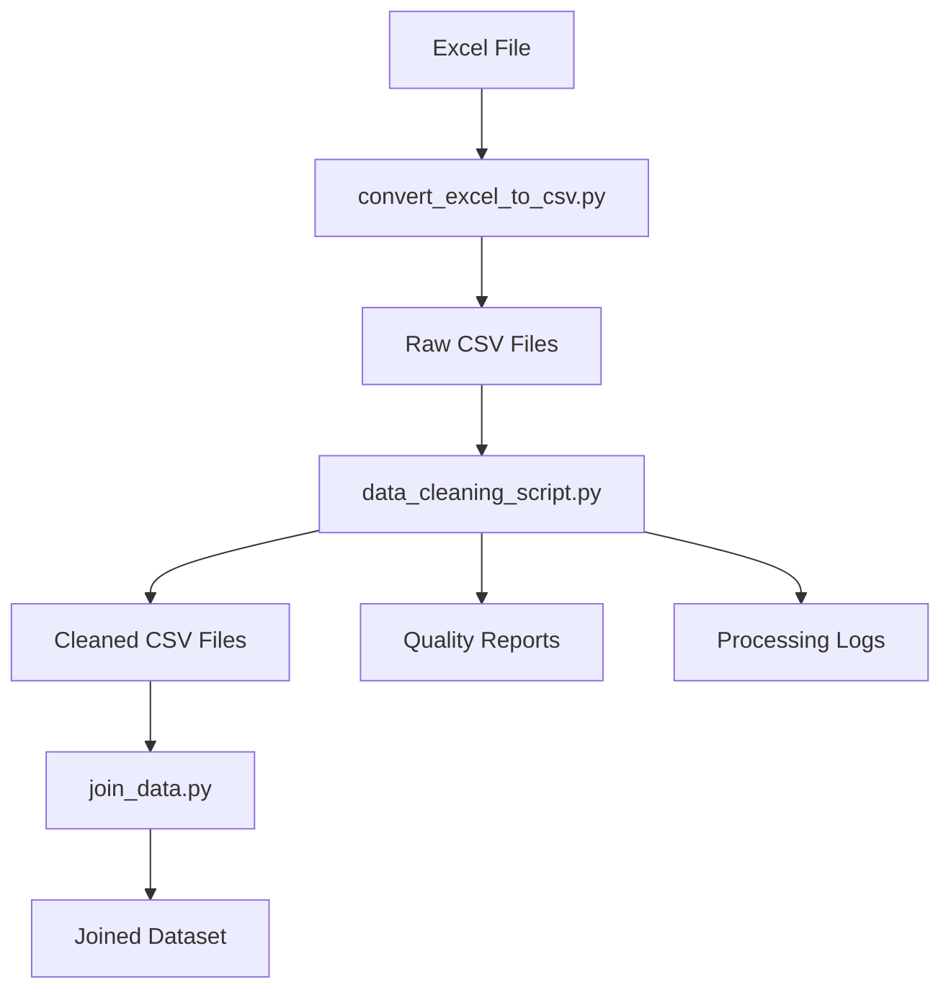

# Mittu - Data Processing Pipeline

[](https://python.org)
[](https://python-poetry.org/)
[](LICENSE)

## 📋 Overview

**Mittu** is a comprehensive data processing pipeline designed to transform, clean, and integrate project management data from Excel/CSV sources. It specializes in handling Brazilian data formats including currency (R$), dates, and percentages, making them ready for analysis and visualization.

## 🚀 Features

- **🔄 Multi-format Support** - Excel to CSV conversion, Brazilian format handling
- **🧹 Smart Data Cleaning** - Automated detection and standardization of dates, currency, percentages
- **🔗 Data Integration** - Joins multiple data sources (projects, costs, hours, KPIs) into unified datasets
- **📊 Quality Assurance** - Comprehensive logging and validation of cleaning operations
- **🇧🇷 Brazilian Format Support** - Native support for R$ currency, Brazilian dates, and percentage formats
- **📝 Detailed Logging** - Complete audit trail of all transformations

## ⚡ Quick Start

### Prerequisites
- Python 3.14+
- [Poetry](https://python-poetry.org/) for dependency management

### Installation
```bash
# Clone the repository
git clone https://github.com/cavalcanteprofissional/mittu.git
cd mittu

# Install dependencies with Poetry
poetry install

# Activate virtual environment
poetry shell
```

### Usage
```bash
# Convert Excel to CSV (if starting from Excel file)
python convert_excel_to_csv.py

# Clean and standardize all CSV files
python data_cleaning_script.py

# Join all cleaned data into integrated dataset
python join_data.py
```

## 📁 Project Structure

```
mittu/
├── data/                           # Data directory
│   ├── csv/                       # Raw CSV files
│   │   ├── Projetos_raw.csv        # Projects data
│   │   ├── Custos_raw.csv          # Cost data
│   │   ├── Horas_raw.csv           # Time tracking
│   │   ├── KPIs_raw.csv            # KPIs & metrics
│   │   └── LEIA_ME.csv            # Documentation
│   ├── cleaned/                    # Processed files
│   │   ├── Projetos_clean.csv
│   │   ├── Custos_clean.csv
│   │   ├── Horas_clean.csv
│   │   └── KPIs_clean.csv
│   ├── logs/                      # Processing logs
│   │   ├── cleaning_report.txt
│   │   ├── detailed_warnings.log
│   │   └── warnings_analysis.txt
│   ├── joined_projects_data.csv     # Integrated final dataset
│   └── raw.xlsx                   # Original Excel source
├── data_cleaning_script.py         # Main cleaning pipeline
├── join_data.py                   # Data integration
├── convert_excel_to_csv.py         # Excel conversion
├── pyproject.toml                 # Project configuration
├── poetry.lock                    # Dependency lock file
└── README.md                      # This file
```

## 🔄 Data Pipeline



## 📜 Scripts Overview

### 1. `convert_excel_to_csv.py`
Converts Excel sheets to individual CSV files.
```bash
python convert_excel_to_csv.py
# Output: data/csv/ with individual CSV files per sheet
```

### 2. `data_cleaning_script.py`
Comprehensive data cleaning pipeline that handles:
- **Date Standardization** - Brazilian formats → YYYY-MM-DD
- **Currency Cleaning** - R$ 1.234,56 → 1234.56
- **Percentage Processing** - Mixed formats → standardized percentages
- **Priority & Status Normalization** - Accent removal, lowercase
- **Time Conversion** - HH:MM → decimal hours

### 3. `join_data.py`
Integrates cleaned data from multiple sources:
- Projects + Costs + Hours + KPIs
- Intelligent project name matching
- Data quality scoring
- Output: `joined_projects_data.csv`

## 🛠️ Data Transformations

### Supported Input Formats

| Data Type | Input Examples | Output Format |
|-----------|----------------|---------------|
| **Dates** | `20/02/26`, `07.01.2026`, `17-03-2026` | `2026-02-20` |
| **Currency** | `R$ 1.234,56`, `"R$ 25,000.00"` | `1234.56` |
| **Percentages** | `"R$ 0,95"`, `"68,91"`, `"90%"` | `"95%"` |
| **Priority** | `"Média"`, `"Alta"`, `"BAIXA"` | `"media"`, `"alta"`, `"baixa"` |
| **Status** | `"Crítico"`, `"On Hold"`, `"EM DIA"` | `"critico"`, `"pausado"`, `"em dia"` |

### Key Features
- **Accent Removal** - Unicode NFD normalization
- **Null Handling** - Multi-layer cleanup
- **Format Detection** - Automatic identification
- **Quality Reporting** - Success rates and warnings

## 📊 Sample Output

After processing, you get:
- **29 unique projects** across 5 departments
- **411 data rows** in integrated dataset
- **Cleaned costs** with Brazilian format support
- **Standardized timelines** and status tracking
- **Quality metrics** and transformation logs

## 🔧 Dependencies

```toml
[tool.poetry.dependencies]
python = "^3.14"
pandas = "^2.0.0"
numpy = "^1.24.0"
```

## 📈 Data Quality Features

### Comprehensive Validation
- **Format Detection** - Automatic identification of input patterns
- **Error Logging** - Detailed warnings for problematic values
- **Success Metrics** - Processing statistics per file
- **Data Integrity** - Preservation of valid values

### Quality Reports
```
File: Projetos_raw.csv
  Total Records: 36
  Dates Standardized: 68
  Currency Cleaned: 36
  Success Rate: 100.0%
```

## 🤝 Contributing

1. Fork the repository
2. Create a feature branch: `git checkout -b feature/amazing-feature`
3. Commit your changes: `git commit -m 'Add amazing feature'`
4. Push to the branch: `git push origin feature/amazing-feature`
5. Open a Pull Request

## 📝 Usage Examples

### Processing New Data
```python
# Load cleaned data
import pandas as pd
df = pd.read_csv('data/joined_projects_data.csv')

# Quick analysis
print(f"Total projects: {df['project_id'].nunique()}")
print(f"Projects by status: {df['status'].value_counts()}")
print(f"Total costs: R${df['valor_clean'].sum():,.2f}")
```

### Custom Cleaning
```python
# Use data cleaner for custom files
from data_cleaning_script import DataCleaner

cleaner = DataCleaner()
cleaned_data = cleaner.clean_projetos_raw('your_file.csv')
```

## 📄 License

This project is licensed under the MIT License - see the [LICENSE](LICENSE) file for details.

## 🏆 Acknowledgments

- **Poetry** - Dependency management
- **Pandas** - Data manipulation powerhouse
- **Unicode** - Accent handling and normalization

---

*Built with ❤️ for Brazilian data processing needs*